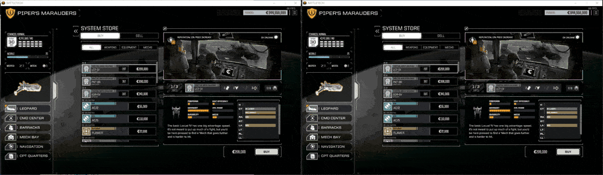
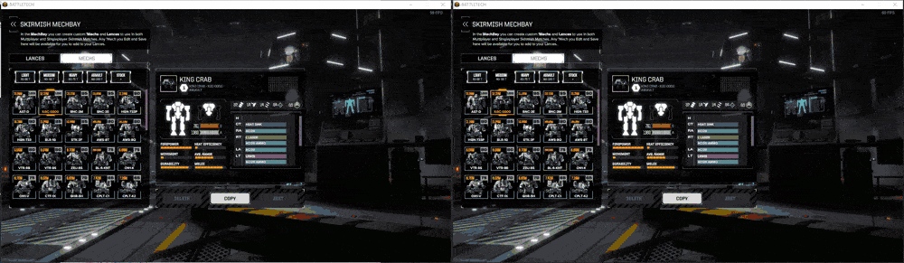
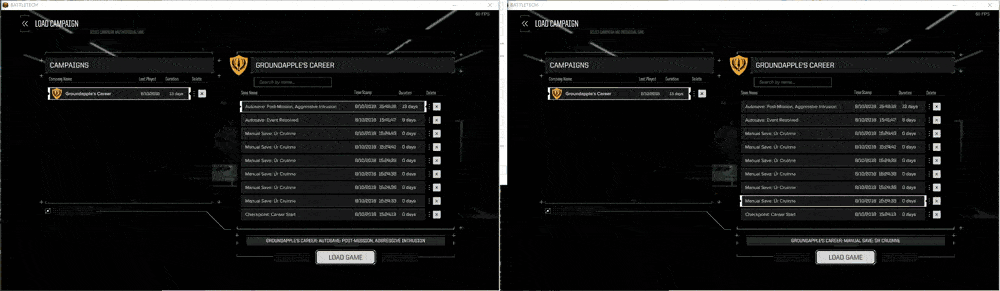

This mod is fully compatible with https://github.com/Sheep-y/BattleTech_Turbine

# Requirements
- BTML  : [https://github.com/janxious/BattleTechModLoader/releases](https://github.com/janxious/BattleTechModLoader/releases)
- ModTek: [https://github.com/janxious/ModTek/releases](https://github.com/janxious/ModTek/releases)

For an install guide see here: [https://github.com/janxious/ModTek/wiki/The-Drop-Dead-Simple-Guide-to-Installing-BTML-&-ModTek-&-ModTek-mods](https://github.com/janxious/ModTek/wiki/The-Drop-Dead-Simple-Guide-to-Installing-BTML-&-ModTek-&-ModTek-mods)

# Comparisons (Right side is with fix applied)

## Store Fix (249 unique items in sell list) 

---  

## MechlabThottling + ItemsList Fix (249 unique items in list)

---  

## Load times (Note: both sides include [Sheep-y's Turbine fix](https://github.com/Sheep-y/BattleTech_Turbine))
#### experimentalLazyRoomInitialization  
- Delay loading of rooms on Leopard until you actually require them  
#### experimentalLoadFixes  
- Speed up JSON processing by only stripping comments & correcting if required.  

